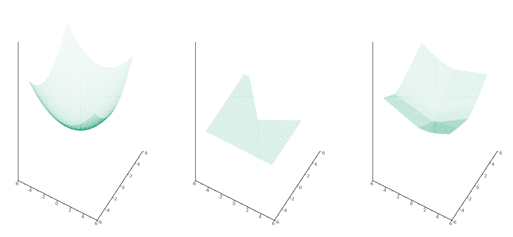

# CppAutoGrad - AutoGrad implementation for self teaching purposes

A tensor and automatic gradient computation library using reverse
gradient accumulation similar to PyTorch's autograd.

Note that CppAutoGrad is written with *C++23* features and is not
compatible with prior C++ versions.

## Usage examples

### Automatic Gradient Computation

(see `grad_demo.cpp`)

This exercises almost all possible differentiable operations from `AutogradFunction.h`:

```cpp
#include <iostream>

#include "autograd/autograd.h"

int main()
{
	num::Tensor<double> a(-4);
	num::Tensor<double> b(2);
	num::Tensor<double> c = a + b;
	
	num::Tensor<double> d = a * b + autofn::pow<double>(b, 3);
	c = c + c + num::Tensor<double>(1);
	c = c + num::Tensor<double>(1) + c + (-a);
	d = d + d * num::Tensor<double>(2) + autofn::relu<double>(b + a);
	d = d + num::Tensor<double>(3) * d + autofn::relu<double>(b - a);
	num::Tensor<double> e = c - d;
	num::Tensor<double> f = autofn::pow<double>(e, 2);
	num::Tensor<double> g = f / num::Tensor<double>(2);
	g = g + num::Tensor<double>(10)/f;
	std::cout << "g: " << g.toString() << std::endl; // prints 24.7041, the outcome of this forward pass
	g.backward();
	// prints 138.8338, i.e. the numerical value of dg/da
	std::cout << "a gradient: " << a.getGradient().toString() << std::endl;
	// prints 645.5773, i.e. the numerical value of dg/db
	std::cout << "b gradient: " << b.getGradient().toString() << std::endl;
}
```

I replicated the test from [Andrej Karpathy's micrograd README](https://github.com/karpathy/micrograd).

### Neural Network Training

(see `model_demo.cpp`)

Define a model class like this:

```cpp
template <num::num_t T>
class RegressionModel : public nn::Module<T, RegressionModel<T>> {
public:
	RegressionModel()
	: linLayer1 (this->registerModule(nn::Linear<T>(2, 10))),
	  linLayer2 (this->registerModule(nn::Linear<T>(10, 1, false)))
	{}

	num::Tensor<T> forward(const num::Tensor<T>& x) const
	{
		num::Tensor<T> out = autofn::relu<T>(linLayer1.forward(x));
		return linLayer2.forward(out);
	}
private:
	nn::Linear<T> linLayer1;
	nn::Linear<T> linLayer2;
};
```

This can be used for the following training loop to perform
regression on the function $x^2 + y^2$:

```cpp
RegressionModel<double> regModel;
optim::Adam<double> opt(regModel.parameters, 0.1);

num::Tensor<double> trainingData = num::randUniform<double>({1000, 2}, -5, 5);

num::Tensor<double> validationData = num::randUniform<double>({100, 2}, -5, 5);


int batchSize = 50;
int epochs = 30;

for (int i = 0; i < epochs; i++) {

	// first way to loop over Tensor
	for (int j = 0; j < trainingData.dims[0]; j+=batchSize) {
		opt.zeroGradient();
		trainingData
			.get({num::Slice{j, j+batchSize, std::nullopt}})
			.iter([&regModel, &trainingData, &opt](const auto& idx, const auto& el) {
				num::Tensor<double> z = autofn::pow<double>(el.get({0,0}),2) +
						autofn::pow<double>(el.get({0,1}), 2);

				num::Tensor<double> zPred = regModel.forward(el);

				num::Tensor<double> loss = autofn::mseLoss<double>(zPred, z);
				loss.backward();
			});
		opt.step();

	}
	
	num::Tensor<double> valLossTotal(0);
	// another way to loop over Tensor
	for (int j = 0; j < validationData.dims[0]; j++) {
		num::Tensor<double> z = autofn::pow<double>(validationData.get({j,0}),2) +
				autofn::pow<double>(validationData.get({j,1}), 2);

		num::Tensor<double> zPred = regModel.forward(validationData.get({j}));

		valLossTotal = valLossTotal + autofn::mseLoss<double>(zPred, z);
	}
	valLossTotal = valLossTotal / num::Tensor<double>(validationData.dims[0]);
	std::cout << "Epoch " << i << " average validation loss: " << valLossTotal.get({0}).toString() << std::endl;
}
```

**Results**:

From left to right:

* the actual function $z = x^2 + y^2$:
* the model prediction **before** training
* the model prediction **after** training



(Plots created with [sciplot](https://github.com/sciplot/sciplot/))


## Installation

This is a header only library so you need to include the header files
in your project with one of the following options:

* **Option 1**: manually copy the folder `autograd` into your project.
* **Option 2**: automatically download from GitHub with CMake by adding
something like this to your `CMakeLists.txt`:

```cmake
include(FetchContent) # If not included already

FetchContent_Declare(cppAutoGrad_content
  GIT_REPOSITORY https://github.com/ccrownhill/cppAutoGrad.git
  GIT_TAG master)

FetchContent_GetProperties(cppAutoGrad_content)
if(NOT cppAutoGrad_content_POPULATED)
  FetchContent_Populate(cppAutoGrad_content)
endif()

include_directories(${cppAutoGrad_content_SOURCE_DIR})
```